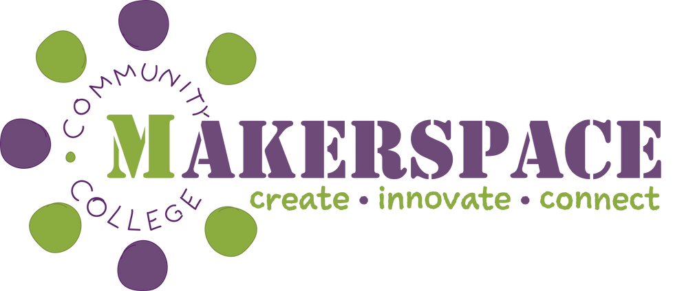

# TechClub

 

TechClub is a community tailored for individuals who possess a strong foundation in computer literacy and are actively engaged in their own tech-oriented projects. Our club serves as a collaborative space where members with skills and a passion for technology can come together to exchange ideas, share expertise, and collaborate on innovative projects.

Please note that TechClub is a non instructional support group and cannot cater for those without basic computer skills. If this is you, please contact the [Mid North Coast Community College](https://www.mnccc.edu.au/) for introduction to computers courses.

TechClub meets in person on Wednesday nights at [MakerSpace](https://www.mncccmakerspace.org.au/), an amazing community facility operated by [Mid North Coast Community College](https://www.mnccc.edu.au/) at their Albert circuit premises in Port Macquarie. Other social clubs are already running at [MakerSpace](https://www.mncccmakerspace.org.au/), including Ceramics, Crochet, Table Top Games and Upcycled sewing. TechClub joins this existing framework.

TechClub members will likely be most interested in the 3D printers and laser cutter in the "FabLab", or perhaps the soundproof digital recording room "Studio A".  Also available to [MakerSpace](https://www.mncccmakerspace.org.au/) members are "The Shed" fully equiped woodworking workshop, "The Department of the Arts" art space, The FabLab also contains sewing machines, overlockers, decal cutting machines (Cricut), a Heat Press and more “The Tinker Space” is a multi use space housing a pottery kiln, and a plastics granulator and extruder.  Tea/coffee/lunch making facilities are available.

Example projects would be 3D printing, electronics, Arduino, Raspberry Pi, Coding, [RoboWars](https://www.robowars.com.au/), AI, building drones and other RC craft, etc.  

Have a look at the [projects page](https://github.com/NathanDigital/TechClub/tree/main/projects) to see what some of our members are working on.

If you don't yet have a project of your own, have a look at our Recruiting page (todo) where we attempt to build a small class to take on a project together.

You must be a [member of MakerSpace](https://www.mncccmakerspace.org.au/membership) to attend. This costs $20/month for adults and $15 for concession. There are a limited number of no cost “Community Memberships” available for eligible disadvantaged community members, please enquire at the [college](https://www.mnccc.edu.au/).  

We also chat and collaborate online at any time via [GitHub Discussions](https://github.com/NathanDigital/TechClub/discussions). You will need to have a [GitHub](https://github.com) account to join the discussions. The [GitHub app](https://github.com/mobile) can chat on your mobile device and receive notifications when new comments are posted, just like any other chat app. 

Please also see the [FAQ](https://github.com/NathanDigital/TechClub/tree/main/faq)
